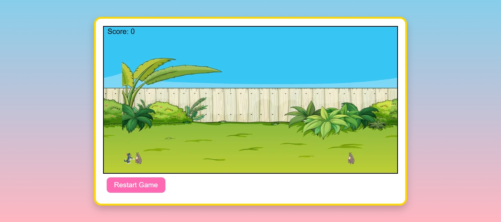

# Cartoon Jump Game

A simple 2D side-scrolling jumping game built with **HTML5 Canvas** and **JavaScript**, featuring:
- Cartoon character
- Cartoon obstacles
- Scrolling background
- Score tracking
- Start/Restart buttons
- In-game instructions

---
## 🖼 Preview

## 🎮 How to Play
- **Press SPACE** to jump over obstacles.
- Avoid colliding with obstacles.
- Each obstacle you pass increases your score.
- The game ends when you hit an obstacle.
- Click **Restart** to try again.

---

## 🖼 Game Assets
The game uses three images:
- `character.png` → The main player character  
- `obstacle.png` → The obstacles to jump over  
- `background.png` → The scrolling game background  

